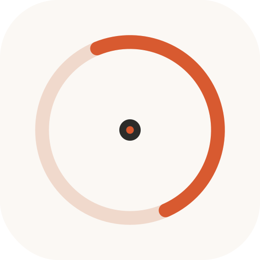
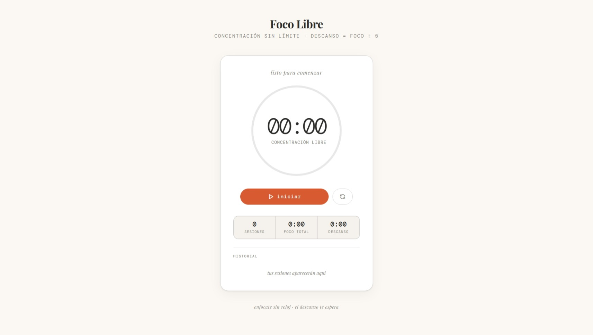

<p align="center">
  
</p>

<h1 align="center">Free Focus ⏱</h1>

Un temporizador de concentración sin límite de tiempo, inspirado en el método pomodoro pero con una diferencia clave: **vos decidís cuándo termina tu sesión**. Al hacerlo, la app calcula automáticamente tu descanso:

```
descanso = tiempo_de_foco / 5
```

Si concentraste 50 minutos, te ganás 10 de descanso. Sin configuración, sin fricción.

<p align="center">
  
</p>

## Usar la app

👉 **[freefoc.netlify.app](https://freefoc.netlify.app/)**
